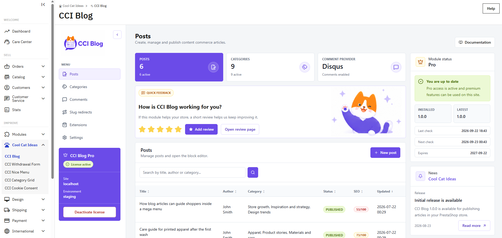
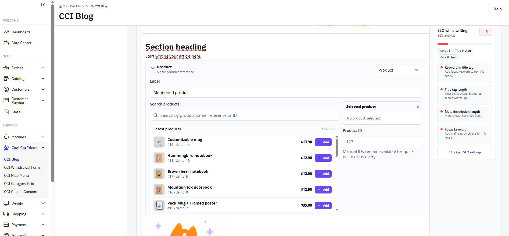
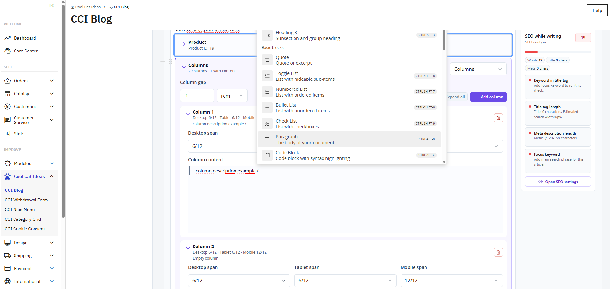

# CCI Blog

Publish articles and buying guides directly in PrestaShop, so a reader can move from useful content back to the catalogue without leaving the shop. Write in the visual editor, add author profiles and tables of contents, and publish article data that search engines can read.

## See what you can build

### Put helpful articles in front of your customers

Show buying guides, product stories and practical advice on your shop homepage. Readers can discover the blog while browsing your offer.

### Keep publishing inside PrestaShop

Search your articles, check publication status and return to editing from one list. Categories, author profiles and SEO controls help you look after the content as it grows.

### Recommend products in context with PRO

Writing about a product? Find it by name, reference or ID and add it to the article. Readers get a direct route from your advice to the relevant offer.

### Shape longer guides with PRO columns

Place content side by side and set column widths for desktop, tablet and mobile. The slash menu lets you add blocks while writing inside a column.

The admin screenshots show a store with PRO active. The base edition includes publishing in the main shop language, the visual editor, categories, author profiles and SEO controls. Product blocks and columns shown above require PRO.

[Explore CCI Blog and compare editions](https://coolcatideas.com/products/cci-blog/) · [Read the documentation](https://coolcatideas.com/docs/cci-blog/1.0.0/)

## Start publishing

1. Install `cci_blog-1.0.0.zip` in **Modules > Module Manager**.
2. Open **Cool Cat Ideas > CCI Blog**.
3. Go to **Categories** and add the first category.
4. Go to **Posts**, create an article and assign its main category.
5. Add headings and text in the visual editor, then publish the article.
6. Open the article on the storefront and check it on desktop and mobile.

To show an author box, edit the employee in **Advanced Parameters > Team > Employees**, open **CCI Blog author profile**, enable the public profile and add a biography. Free saves it in the default shop language. Pro adds a separate biography for every shop language.

If an article does not appear, check its active state, publication date, shop assignment, language and category. Then clear the PrestaShop cache.

The base module works without a license key. CCI Blog Pro is optional and adds more layout, language, Multistore and product-content tools.

[Full documentation](https://coolcatideas.com/docs/cci-blog/1.0.0/)

## Support

Use the product repository under https://github.com/orgs/cool-cat-ideas/repositories for public questions and bug reports. This channel has no guaranteed response time. When you need a private request with an agreed scope, buy a support service on the product page; the request and further messages are then handled in the Cool Cat Ideas customer panel.

## Changelog

### 1.0.0

- First public release.

## Building and contributing

See [Build from source](docs/building-from-source.md) for the npm workflow. Shared components, styles and API adapters are maintained in [CCI Admin UI](https://github.com/cool-cat-ideas/cci-admin-ui).
